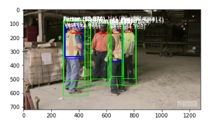

# Steps to run this

1) Create a virtual enviornment
2) Activate the enviorment
3) pip install -r requirements.txt
4) run save_model.py, After running it under checkpoints folder **ppe_yolov4-tiny-608-24thAug** should be generated.
     This is the keras checkpoint which we'll use in out jupyter notebook
5) After running the save model launch **PortExistingModelToCoreML.ipynb** . After running the final cell of jupyter
    Predictions should be visible
 

   