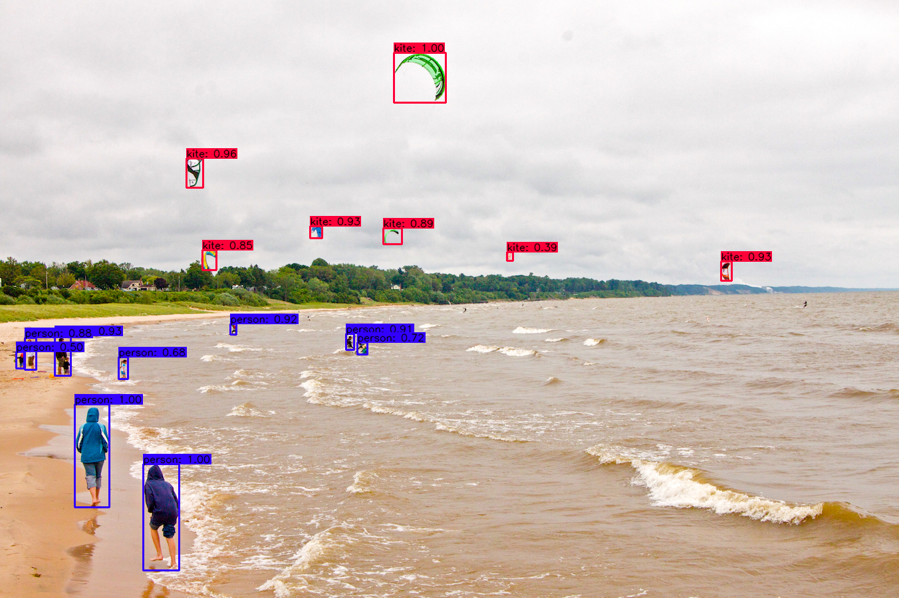

# tensorflow-yolov4-tflite
YoloV4 Implemented in Tensorflow 2.0. Convert .weights to .tflite format for tensorflow lite.

Download yolov4.weights file: https://drive.google.com/open?id=1cewMfusmPjYWbrnuJRuKhPMwRe_b9PaT


### Prerequisites
Tensorflow 2.1.0
tensorflow_addons 0.9.1 (require for mish activation)
requirements.txt

### Performance
<p align="center"></p>

### Demo

```bash
# yolov4
python detect.py --weights ./data/yolov4.weights --framework tf --size 608 --image ./data/kite.jpg
```

#### Output
<p align="center"></p>


### Evaluate on COCO 2017 Dataset
```bash
# preprocess coco dataset
cd data
mkdir dataset
cd ..
cd scripts
python coco_convert.py --input COCO_ANOTATION_DATA_PATH --output val2017.pkl
python coco_annotation.py --coco_path COCO_DATA_PATH 
cd ..

# evaluate yolov4 model
python evaluate.py --weights ./data/yolov4.weights
cd mAP/extra
python remove_space.py
cd ..
python main.py --output results_yolov4_tf

```

### TODO
* [ ] Training code
* [ ] greedy NMS
* [ ] Update scale xy
* [ ] ciou
* [ ] Mosaic data augmentation
* [ ] yolov4 tflite version
* [ ] yolov4 in8 tflite version for mobile

### References

  * YOLOv4: Optimal Speed and Accuracy of Object Detection [YOLOv4](https://arxiv.org/abs/2004.10934).
  * [darknet](https://github.com/AlexeyAB/darknet)
  * [Yolov3 tensorflow](https://github.com/YunYang1994/tensorflow-yolov3)
  * [Yolov3 tf2](https://github.com/zzh8829/yolov3-tf2)

