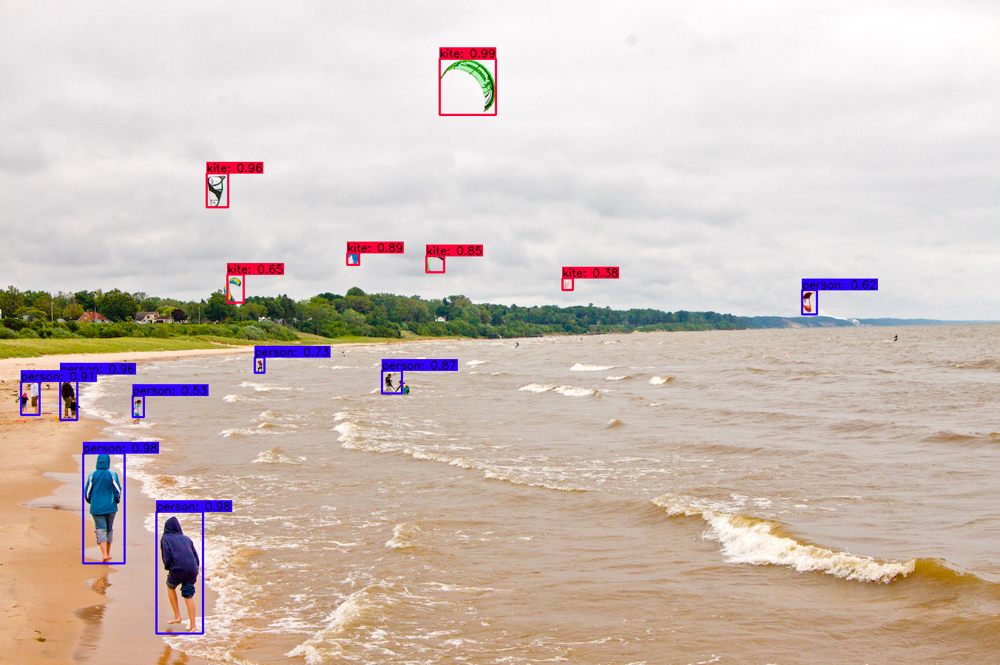

# tensorflow-yolov4-tflite
[](LICENSE)

YOLOv4 Implemented in Tensorflow 2.0. 
Convert YOLO v4 .weights to .pb and .tflite format for tensorflow and tensorflow lite.

Download yolov4.weights file: https://drive.google.com/open?id=1cewMfusmPjYWbrnuJRuKhPMwRe_b9PaT


### Prerequisites
* Tensorflow 2.1.0
* tensorflow_addons 0.9.1 (required for mish activation)

### Performance
<p align="center"></p>

### Demo

```bash
# yolov4
python detect.py --weights ./data/yolov4.weights --framework tf --size 608 --image ./data/kite.jpg

# yolov4 tflite
python detect.py --weights ./data/yolov4-int8.tflite --framework tflite --size 416 --image ./data/kite.jpg
```

#### Output

##### Yolov4 original weight
<p align="center"></p>

##### Yolov4 tflite int8
<p align="center"></p>

### Convert to tflite

```bash
# yolov4
python convert_tflite.py --weights ./data/yolov4.weights --output ./data/yolov4.tflite

# yolov4 quantize int8
python convert_tflite.py --weights ./data/yolov4.weights --output ./data/yolov4-int8.tflite --quantize_mode int8

# yolov4 quantize float16
python convert_tflite.py --weights ./data/yolov4.weights --output ./data/yolov4-fp16.tflite --quantize_mode float16

# yolov4 quantize int8 full (with all function is converted to int8)
python convert_tflite.py --weights ./data/yolov4.weights --output ./data/yolov4-fp16.tflite --quantize_mode full_int8 --dataset ./coco_dataset/coco/val207.txt
```

### Evaluate on COCO 2017 Dataset
```bash
# run script in /script/get_coco_dataset_2017.sh to download COCO 2017 Dataset
# preprocess coco dataset
cd data
mkdir dataset
cd ..
cd scripts
python coco_convert.py --input ./coco/annotations/instances_val2017.json --output val2017.pkl
python coco_annotation.py --coco_path ./coco 
cd ..

# evaluate yolov4 model
python evaluate.py --weights ./data/yolov4.weights
cd mAP/extra
python remove_space.py
cd ..
python main.py --output results_yolov4_tf

```
### Traning your own model
```bash
# Prepare your dataset
# If you want to train from scratch:
In config.py set FISRT_STAGE_EPOCHS=0 
# Run script:
python train.py

# Transfer learning: 
python train.py --weights ./data/yolov4.weights
```

### TODO
* [ ] YOLOv4 tflite on android
* [ ] YOLOv4 tflite on ios
* [x] Training code
* [x] Update scale xy
* [ ] ciou
* [ ] Mosaic data augmentation
* [x] Mish activation
* [x] yolov4 tflite version
* [x] yolov4 in8 tflite version for mobile

### References

  * YOLOv4: Optimal Speed and Accuracy of Object Detection [YOLOv4](https://arxiv.org/abs/2004.10934).
  * [darknet](https://github.com/AlexeyAB/darknet)
  
   My project is inspired by these previous fantastic YOLOv3 implementations:
  * [Yolov3 tensorflow](https://github.com/YunYang1994/tensorflow-yolov3)
  * [Yolov3 tf2](https://github.com/zzh8829/yolov3-tf2)
